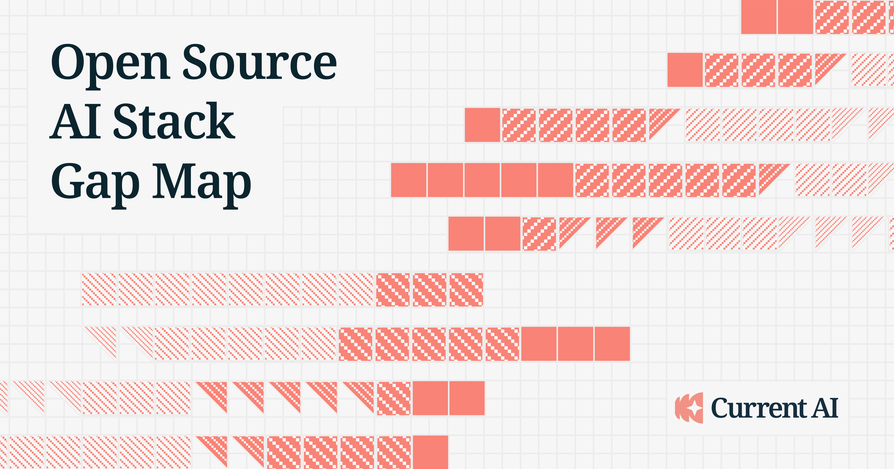

<div align="center">

<a href="https://map.currentai.org/"></a>

**The public data + scoring behind the [Open Source AI Gap Map](https://map.currentai.org/).**

<!-- Stat badges below are auto-generated by build/update_readme.py on regenerate; do not hand-edit the numbers. -->
<p align="center">
  
  
  
  <a href="https://github.com/currentai-org/os-ai-map/actions/workflows/validate.yml"></a>
  <a href="LICENSE"></a>
</p>

</div>

---

The open source AI stack is already strong, but it's fragmented, duplicative, and hard to
see as a whole. The [Open Source AI Gap Map](https://map.currentai.org/) makes it legible: a
living map of what exists across the stack, how open each piece is, how widely it's used, and
where the gaps are — so the community can see where to build, where to invest, and where to
open things up.

This repo is the data behind that map. Everything is curated YAML in `sources/`; a
deterministic pipeline validates it, serializes it to `build/notebook_data.json`, and renders
the published map.

---

## Architecture and the asset inventory

`docs/architecture/` records how the data assets fit together: what each namespace means, what
the gates protect, and where the repository boundary sits. The inventory it specifies is
[`warehouse/assets.yaml`](warehouse/assets.yaml) — one entry per **governed** asset (ADR-003), each
carrying a `role`, with grain, authority, producer and derived dependencies. Required OSO inputs the
map does not own are contracts in [`warehouse/dependencies.yaml`](warehouse/dependencies.yaml).

Check it before assuming a table is unused. An empty reader list is not evidence: many of the
organization's notebooks are not tracked here, and the deployed-model audit (recorded in
`warehouse/audits/platform_models.json`) is what confirms a table has no reader.


## Contribute

The map is a public, iterative effort, and community curation is the point. There are two ways in:

1. **File an issue** (no code needed):
   [suggest a product](https://github.com/currentai-org/os-ai-map/issues/new?template=suggest-a-product.yml),
   [report an error](https://github.com/currentai-org/os-ai-map/issues/new?template=report-an-error.yml), or
   [propose a category](https://github.com/currentai-org/os-ai-map/issues/new?template=propose-a-category.yml).

2. **Open a pull request** editing `sources/`. Adding a product is a handful of small YAML files:
   a product record, a score with citations, and an entry in one category roster and one
   organization roster. [CONTRIBUTING.md](CONTRIBUTING.md) has the full recipe and the scoring rubric.

A few ground rules:

- **Every score cites a primary source.** The map excludes anything it can't verify against one.
- **Don't hand-edit generated files.** `build/notebook_data.json` and `notebooks/ai-stack-map.py`
  are regenerated by a bot on merge; PRs that touch them are blocked.
- **CI runs on every PR** (`build.validate` + `pytest`), so you'll know quickly if something is off.

---

## How scoring works

Each product is graded on three independent, multi-source axes:

- **Openness** — a 0–5 grade against openness frameworks (the [Model Openness Framework](https://arxiv.org/abs/2403.13784)
  for models, OSI license classes for software), not a yes/no. The open-source vs. open-weights
  distinction is the one the map exists to draw.
- **Adoption** — real usage (downloads, active users, deployments), not GitHub stars.
- **Capability** — community benchmarks where they exist, feature coverage where they don't.

Adoption and capability blend into a single **overall score** per product, banded as *Leading*
(score ≥ 4.5) or *Strong* (4.0 ≤ score < 4.5). Categories then roll up from their products into a **Maturity
Stage** (0 Void → 5 Mature) plus a set of **gaps** naming what the open ecosystem still lacks. The taxonomy and openness framework
descend from the [2024 Columbia Convening on Openness in AI](https://arxiv.org/abs/2405.15802).

The complete method — the stage and gap formulas, per-axis sources, and stated limitations — is in
[`docs/methodology.md`](docs/methodology.md), the hand-authored source of truth (also rendered
[on the site](https://map.currentai.org/methodology)).

---

## What's in `sources/`

One YAML file per record: four concerns plus the single `sources/taxonomy.yaml` manifest. This is
what you edit.

| Path | Contains | Key rule |
|------|----------|----------|
| `sources/organizations/` | Org metadata and a `products:` roster | Each product slug appears in exactly one org roster |
| `sources/categories/` | Category definition (`weights`, `strapline`, …) and an ordered `products:` roster | Order = display order; each product in exactly one category |
| `sources/products/` | Product record (`name`, `type`, `description`, typed artifact URLs) | Org membership lives in the org file, not here |
| `sources/scores/` | Per-product `openness`, `adoption`, `capability` | Every non-null score value needs a `sources:` citation |
| `sources/taxonomy.yaml` | Arc grouping + display order; the three arcs are the Columbia ontology layers | Every category appears in exactly one arc |
| `sources/allowlists/` | `undigested_sources.txt`, the sources grandfathered before the digest discipline | Anything not listed must carry a `content_sha256`; the list only shrinks |
| `sources/snapshots/` | `long_tail.json`, the frozen dedup counts | Re-sync after a batch, or `validate` fails on the product count |

Category slugs use underscore form (`base_pretrained`); product and org slugs use hyphenated
kebab-case (`llama-3-1`, `allen-ai`). Artifact keys on products (only those that apply): `github`,
`npm`, `pypi`, `crates`, `go`, `huggingface_model`, `huggingface_dataset`. JSON Schemas for every
file type live in [`docs/schemas/`](docs/schemas/).

---

## Run it locally

Requires Python 3.12+ and [uv](https://docs.astral.sh/uv/). No API key is needed to edit sources or validate.

```bash
uv sync
uv run python -m build.validate    # schema + cross-file checks; must print "0 error(s)"
uv run pytest -q                   # optional; the same suite CI runs
```

To preview the generated map locally (the output is for preview only — don't commit it):

```bash
uv run python -m build.serialize                                          # sources/ → build/notebook_data.json
uv run python -m build.render                                             # → notebooks/ai-stack-map.py
uv run marimo export html notebooks/ai-stack-map.py -o /tmp/preview.html
```

Warehouse queries (via `pyoso`) need `OSO_API_KEY`; with `direnv`, place it in `.env` and it loads automatically.

---

## Repository layout

| Path | Role |
|------|------|
| `sources/` | Curated YAML you edit: organizations, categories, products, scores, plus `taxonomy.yaml`, `allowlists/` and `snapshots/` |
| `build/` | Deterministic validate → serialize → render pipeline |
| `notebooks/` | Generated `ai-stack-map.py` + standalone companion notebooks |
| `docs/` | JSON Schemas, contributor guides, methodology, and maintainer runbooks |
| `warehouse/` | UDM SQL and ingest fetchers for adoption / activity signals |
| `skills/` | Agent skills mirroring the contribution recipes |
| `tests/` | pytest suite for build helpers |

Guides worth knowing: [openness scoring](docs/reference/openness.md),
[adoption scoring](docs/reference/adoption.md), [gap analysis](docs/reference/gap-analysis.md),
and [query conventions](docs/reference/queries.md).
See [AGENTS.md](AGENTS.md) for agent-oriented project context.

---

<details>
<summary><strong>Maintainer &amp; internal reference</strong></summary>

<br>

**Warehouse.** `warehouse/` holds the SQL models and fetchers that power adoption and activity
signals. Contributors work read-only here; only maintainers write.

- `warehouse/models/` — SQL and Python model files at `models/<dataset>/<table>`. Most are governed (the registry serializers, the evaluation builders, the signal ingestion), claimed by `warehouse/assets.yaml`; the rest are **read-only mirrors of platform-owned models**, claimed by `warehouse/dependencies.yaml` as dependency contracts (a mirror binds provenance, not ownership).
- `warehouse/data/` — frozen CSV inputs at `data/<dataset>/<table>.csv`.
- `warehouse/assets.yaml` — the governed-asset inventory: one entry per governed asset with a `role`, authority, grain, provenance and derived reads/read_by. Required OSO inputs are contracts in `warehouse/dependencies.yaml`.

**Operations** (require OSO MCP write access — see `docs/operations/`):

- `deploy-models.md` — revise and release UDM SQL changes
- `refresh-data.md` — run fetchers and reload static models
- `publish-map.md` — serialize, render, and publish the live notebook

**Editor skills.** Eight skills in `skills/` mirror the CONTRIBUTING recipes and enforce the same
read-only warehouse boundary:

- `edit-category` — create a category, or edit its description, strapline, weights, or roster
- `add-product` — add a new product (scaffolds product + score YAML, updates the roster)
- `build-rubric` — derive a category's openness ladder, or extend a shared one to it
- `update-product` — change an existing product (identity, prose, a score, rosters, retirement)
- `refresh-category` — re-verify a whole category: scores and prose together, to the PR
- `refresh-all-categories` — drive the sweep: report progress, pick the next category
- `add-data-source` — register a new external data source and add a fetcher
- `pyoso-analyst` — query `currentai.*` tables via `pyoso` (read-only analysis)

**Companion notebooks.** `pypi-geo-trends.py`, `oss-ai-trends.py`, and `long-tail-explorer.py` are
standalone marimo notebooks that sit outside the build pipeline and query `currentai.*` warehouse
tables live via `pyoso`, so the bot never regenerates them. `sources/snapshots/long_tail.json` is a
hand-frozen fixture, not yet derived from live data.

</details>

---

Code and data are [MIT licensed](LICENSE).
