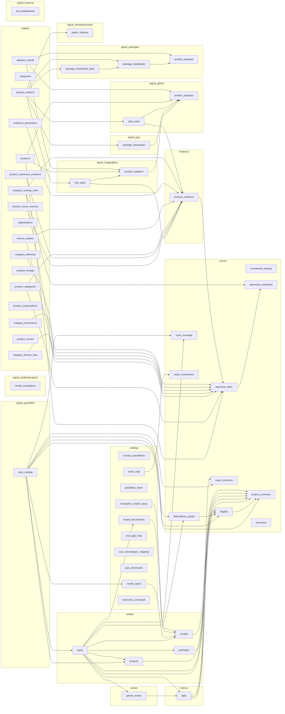

```mermaid
graph LR
  subgraph catalog
    catalog__country_populations[country_populations]
    catalog__foundation_model_repos[foundation_model_repos]
    catalog__goodailist_repos[goodailist_repos]
    catalog__model_benchmarks[model_benchmarks]
    catalog__model_repos[model_repos]
    catalog__osai_gap_map[osai_gap_map]
    catalog__osai_subcategory_mapping[osai_subcategory_mapping]
    catalog__pypi_downloads[pypi_downloads]
    catalog__stack_map[stack_map]
    catalog__taxonomy_crosswalk[taxonomy_crosswalk]
  end
  subgraph entities
    entities__models[models]
    entities__packages[packages]
    entities__projects[projects]
    entities__repos[repos]
  end
  subgraph events
    events__github_events[github_events]
  end
  subgraph evidence
    evidence__product_evidence[product_evidence]
  end
  subgraph metrics
    metrics__daily[daily]
  end
  subgraph registry
    registry__adoption_bands[adoption_bands]
    registry__categories[categories]
    registry__category_deferrals[category_deferrals]
    registry__category_dimensions[category_dimensions]
    registry__category_license_tiers[category_license_tiers]
    registry__category_scoring_rules[category_scoring_rules]
    registry__evidence_abstentions[evidence_abstentions]
    registry__license_aliases[license_aliases]
    registry__organizations[organizations]
    registry__product_artifacts[product_artifacts]
    registry__product_categories[product_categories]
    registry__product_lineage[product_lineage]
    registry__product_openness_evidence[product_openness_evidence]
    registry__product_organizations[product_organizations]
    registry__product_score_sources[product_score_sources]
    registry__product_scores[product_scores]
    registry__products[products]
  end
  subgraph scores
    scores__dependency_graph[dependency_graph]
    scores__fragility[fragility]
    scores__investment_ranking[investment_ranking]
    scores__openness_computed[openness_computed]
    scores__openness_facts[openness_facts]
    scores__ossd_coverage[ossd_coverage]
    scores__project_summary[project_summary]
    scores__repos_summary[repos_summary]
    scores__stack_contributors[stack_contributors]
    scores__taxonomy[taxonomy]
  end
  subgraph signal_artificialanalysis
    signal_artificialanalysis__model_evaluations[model_evaluations]
  end
  subgraph signal_github
    signal_github__product_adoption[product_adoption]
    signal_github__repo_state[repo_state]
  end
  subgraph signal_goodailist
    signal_goodailist__repo_catalog[repo_catalog]
  end
  subgraph signal_huggingface
    signal_huggingface__hub_state[hub_state]
    signal_huggingface__product_adoption[product_adoption]
  end
  subgraph signal_lmarena
    signal_lmarena__text_leaderboard[text_leaderboard]
  end
  subgraph signal_packages
    signal_packages__package_downloads[package_downloads]
    signal_packages__package_downloads_daily[package_downloads_daily]
    signal_packages__product_adoption[product_adoption]
  end
  subgraph signal_pypi
    signal_pypi__package_downloads[package_downloads]
  end
  subgraph signal_semanticscholar
    signal_semanticscholar__paper_citations[paper_citations]
  end
  signal_goodailist__repo_catalog --> catalog__model_repos
  entities__repos --> catalog__model_benchmarks
  catalog__foundation_model_repos --> entities__models
  catalog__model_benchmarks --> entities__models
  catalog__model_repos --> entities__models
  entities__repos --> entities__models
  entities__repos --> entities__packages
  entities__repos --> entities__projects
  signal_goodailist__repo_catalog --> entities__projects
  signal_goodailist__repo_catalog --> entities__repos
  entities__repos --> events__github_events
  entities__repos --> metrics__daily
  events__github_events --> metrics__daily
  entities__repos --> scores__dependency_graph
  signal_goodailist__repo_catalog --> scores__dependency_graph
  entities__repos --> scores__fragility
  metrics__daily --> scores__fragility
  scores__dependency_graph --> scores__fragility
  signal_goodailist__repo_catalog --> scores__fragility
  entities__repos --> scores__ossd_coverage
  signal_goodailist__repo_catalog --> scores__ossd_coverage
  entities__models --> scores__project_summary
  entities__packages --> scores__project_summary
  entities__projects --> scores__project_summary
  entities__repos --> scores__project_summary
  metrics__daily --> scores__project_summary
  scores__fragility --> scores__project_summary
  signal_goodailist__repo_catalog --> scores__project_summary
  metrics__daily --> scores__repos_summary
  signal_goodailist__repo_catalog --> scores__repos_summary
  catalog__stack_map --> scores__stack_contributors
  registry__category_scoring_rules --> evidence__product_evidence
  registry__evidence_abstentions --> evidence__product_evidence
  registry__license_aliases --> evidence__product_evidence
  registry__product_categories --> evidence__product_evidence
  registry__product_openness_evidence --> evidence__product_evidence
  registry__product_score_sources --> evidence__product_evidence
  signal_github__repo_state --> evidence__product_evidence
  signal_huggingface__hub_state --> evidence__product_evidence
  registry__adoption_bands --> signal_github__product_adoption
  registry__products --> signal_github__product_adoption
  signal_github__repo_state --> signal_github__product_adoption
  signal_huggingface__product_adoption --> signal_github__product_adoption
  signal_pypi__package_downloads --> signal_github__product_adoption
  registry__product_artifacts --> signal_github__repo_state
  registry__product_artifacts --> signal_huggingface__hub_state
  registry__adoption_bands --> signal_huggingface__product_adoption
  registry__products --> signal_huggingface__product_adoption
  signal_huggingface__hub_state --> signal_huggingface__product_adoption
  registry__product_artifacts --> signal_packages__package_downloads
  signal_packages__package_downloads_daily --> signal_packages__package_downloads
  registry__product_artifacts --> signal_packages__package_downloads_daily
  registry__adoption_bands --> signal_packages__product_adoption
  signal_packages__package_downloads --> signal_packages__product_adoption
  registry__product_artifacts --> signal_pypi__package_downloads
  registry__category_scoring_rules --> scores__openness_computed
  scores__openness_facts --> scores__openness_computed
  evidence__product_evidence --> scores__openness_facts
  registry__category_deferrals --> scores__openness_facts
  registry__category_dimensions --> scores__openness_facts
  registry__category_license_tiers --> scores__openness_facts
  registry__category_scoring_rules --> scores__openness_facts
  registry__license_aliases --> scores__openness_facts
  registry__product_categories --> scores__openness_facts
  registry__products --> scores__openness_facts
  registry__product_artifacts --> signal_semanticscholar__paper_citations
```
