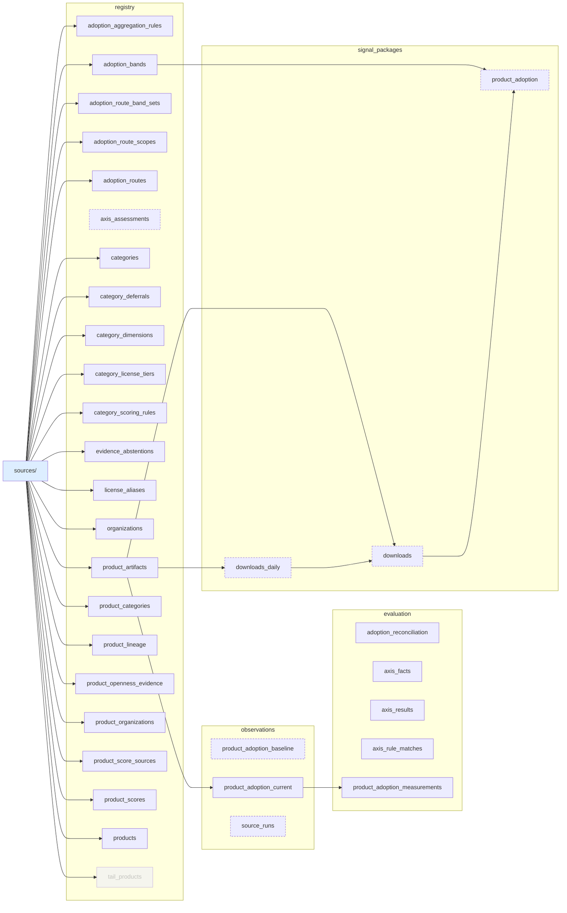
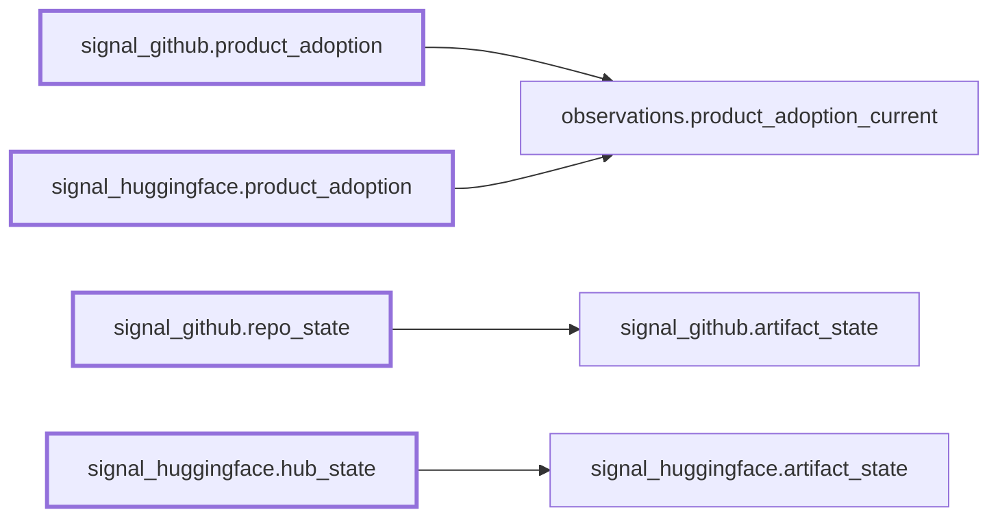

# Current-state dependency graph

Generated by `build.assets.render_dag`, never drawn, and gated: `tests/test_assets_inventory.py`
fails if this file drifts from the renderer. Regenerate with
`uv run python -c "import sys;sys.path.insert(0,'.');from build import assets;print(assets.render_dag())"`.

This graph is **root-scoped** (ADR-003): it is the Open Source AI Gap Map's own data system,
not the OSO organization's warehouse. Nodes are the <!-- count:governed_assets -->38 governed
assets in `warehouse/assets.yaml` (every one carries a `role`) plus the <!-- count:dependencies -->8
external contracts in `warehouse/dependencies.yaml`. There is no externalization backlog
(<!-- count:externalization_backlog -->0): the long-tail pipelines and questionable gap_map tables
were removed and **frozen** under platform ownership (disposition `frozen-without-producer`,
recorded in the reproducible receipt `warehouse/audits/externalization.json`; not an ownership
transfer to a named destination repo) — ADR-003 steps 5-6. A standalone notebook is **never** a
reachability root (gate 5).

Reachability is a real closure from the map roots -- the governed publication sinks and the named
audit/control build modules -- traversed UPSTREAM through repo-owned producer files (governed models
and the read-only dependency mirrors); dependencies are leaves. Three views:

1. **Map governance** -- `sources/` -> `registry`/`evaluation` governed outputs and the repo-owned
   computation chain. A `sources/` edge is drawn only for a serializer-compiled output; node status
   carries through (staged dashed, dormant faded).
2. **Runtime dependencies** -- the OSO / platform inputs in `dependencies.yaml` -> the governed
   computation (and the dependency chain the openness parity gate reaches into).
3. **Compatibility / retirement appendix** -- compatibility shims -> their `replacement`.

Edges are reads found in SQL context -- after `FROM`, `JOIN`, `INTO` or `UPDATE`, or as a bare
table identifier constant. Comments, docstrings and URLs are excluded.

### View 1 — Map governance (sources → governed outputs)

### View 2 — Runtime dependencies (dependencies.yaml → map computation)

```mermaid
graph LR
  currentai__evidence__product_evidence[currentai.evidence.product_evidence]:::dep --> currentai__scores__openness_facts[currentai.scores.openness_facts]:::dep
  currentai__scores__openness_computed[currentai.scores.openness_computed]:::dep --> build/apply_scores__py[build/apply_scores.py]:::audit
  currentai__scores__openness_computed[currentai.scores.openness_computed]:::dep --> build/check_parity__py[build/check_parity.py]:::audit
  currentai__scores__openness_facts[currentai.scores.openness_facts]:::dep --> currentai__scores__openness_computed[currentai.scores.openness_computed]:::dep
  currentai__signal_github__artifact_state[currentai.signal_github.artifact_state]:::dep --> build/check_artifacts__py[build/check_artifacts.py]:::audit
  currentai__signal_github__artifact_state[currentai.signal_github.artifact_state]:::dep --> currentai__evidence__product_evidence[currentai.evidence.product_evidence]:::dep
  currentai__signal_github__artifact_state[currentai.signal_github.artifact_state]:::dep --> currentai__observations__product_adoption_current[currentai.observations.product_adoption_current]
  currentai__signal_github__artifact_state[currentai.signal_github.artifact_state]:::dep --> currentai__signal_github__product_adoption[currentai.signal_github.product_adoption]
  currentai__signal_huggingface__artifact_state[currentai.signal_huggingface.artifact_state]:::dep --> currentai__evidence__product_evidence[currentai.evidence.product_evidence]:::dep
  currentai__signal_huggingface__artifact_state[currentai.signal_huggingface.artifact_state]:::dep --> currentai__observations__product_adoption_current[currentai.observations.product_adoption_current]
  currentai__signal_huggingface__artifact_state[currentai.signal_huggingface.artifact_state]:::dep --> currentai__signal_huggingface__product_adoption[currentai.signal_huggingface.product_adoption]
  currentai__signal_pypi__package_downloads[currentai.signal_pypi.package_downloads]:::dep --> build/check_artifacts__py[build/check_artifacts.py]:::audit
  currentai__signal_pypi__package_downloads[currentai.signal_pypi.package_downloads]:::dep --> currentai__observations__product_adoption_current[currentai.observations.product_adoption_current]
  currentai__signal_pypi__package_downloads[currentai.signal_pypi.package_downloads]:::dep --> currentai__signal_github__product_adoption[currentai.signal_github.product_adoption]
  currentai__signal_semanticscholar__paper_citations[currentai.signal_semanticscholar.paper_citations]:::dep --> currentai__observations__product_adoption_current[currentai.observations.product_adoption_current]
  oso__pypi_downloads__daily_downloads_by_package[oso.pypi_downloads.daily_downloads_by_package]:::dep --> currentai__signal_packages__downloads[currentai.signal_packages.downloads]
  oso__pypi_downloads__daily_downloads_by_package[oso.pypi_downloads.daily_downloads_by_package]:::dep --> currentai__signal_pypi__package_downloads[currentai.signal_pypi.package_downloads]:::dep
  classDef dep fill:#eee;
  classDef audit fill:#ffd;
  classDef src fill:#def;
```

### View 3 — Compatibility / retirement appendix

