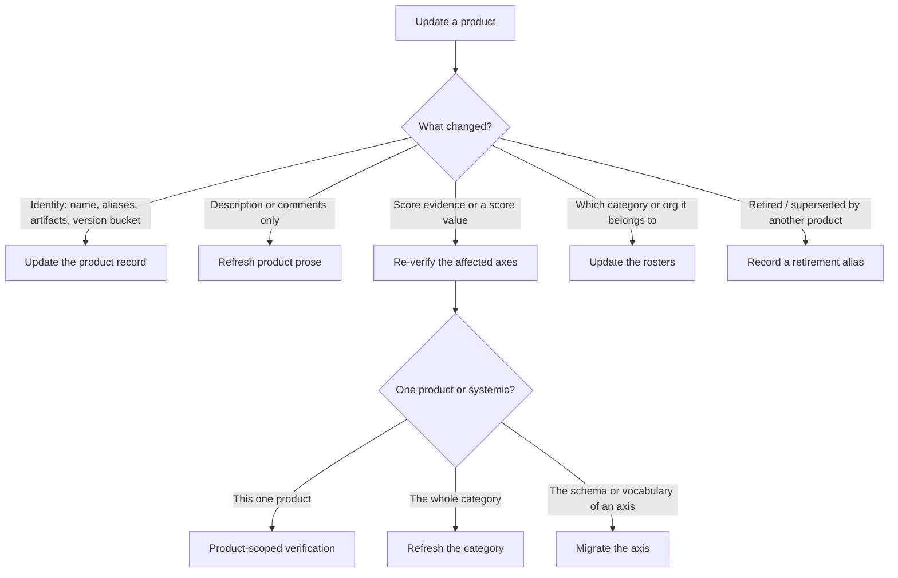

# Update a product

The single door for changing a product that already exists. You should **not** need to know
the internal difference between "verify" and "refresh" before you start — describe what
changed, and this routes you.

## Use this when
Anything about an existing product needs to change. If the product does not exist yet, use
[`add-product.md`](add-product.md).

## Classify the change first



## The routes

### Update the product record — identity, artifacts, version bucket
Edit `sources/products/<slug>.yaml` surgically (never load-modify-dump). The editable fields:
`display_name`, `aliases`, `version_in_identity`, and the **typed artifact arrays**. There is no
single `artifacts` field — artifacts are declared as top-level arrays of `{url: ...}` per kind:
`github`, `npm`, `pypi`, `crates`, `go`, `huggingface_model`, `huggingface_dataset`, `arxiv`
(`product.schema.json` is authoritative). **The slug never changes** — it names the tier, and a
new release of the same tier extends this record rather than creating a new one (this is how a
version bump like "add v1.5" is handled). See [`../reference/identity.md`](../reference/identity.md).
A change to `type` is not a record edit — it can select a different openness ladder, so **escalate
it** (see the axis route below / `build-rubric`). If new artifacts change what adoption should
read, follow the axis route. Validate: `uv run python -m build.validate` and `uv run python -m
build.check_artifacts`.

### Refresh product prose — description or comments only
This is a **prose** change: it never touches scores and never writes `last_verified`. Rewrite
`description`/`comments` to [`../reference/product-copy.md`](../reference/product-copy.md) against
primary sources, strip any hardcoded star/download count, and keep the load-bearing facts.
Run standalone, this is the prose pass (formerly the `verify-product` skill). Validate:
`uv run python -m build.validate`.

### Re-verify the affected axes — a score's evidence or value moved
A score change is evidence work, and it earns a date. Do **not** just edit the number.
- **One product:** re-read its cited sources, re-derive the axis, record the evidence and a real
  `last_verified` per [`../reference/evidence-and-freshness.md`](../reference/evidence-and-freshness.md).
  If it places a capability band against a peer, the peer must be confirmed at least as recently.
- **The whole category is stale:** use [`refresh-category.md`](refresh-category.md) instead of
  doing products one at a time.
- **The schema or meaning of the axis is changing** (not this product's value, but what the axis
  records): stop and use [`migrate-axis.md`](migrate-axis.md).

### Update the rosters — category or organization membership
Move the slug between `sources/categories/*.yaml` and/or `sources/organizations/*.yaml`. A slug
appears in exactly one of each. See [`edit-category.md`](edit-category.md) for the category side.

### Record a retirement alias — the product was superseded
A slug is retired only by being recorded as an **alias** on the product that replaced it, never
deleted — `check_retirement` fails a slug that leaves the payload without a redirect. Add the
retired slug to the successor's `aliases`, and remove its own files. See
[`../reference/identity.md`](../reference/identity.md). Validate:
```bash
uv run python -m build.validate
uv run python -m build.serialize --date ci-dry-run   # regenerate the payload first…
uv run python -m build.check_retirement              # …or this compares two payloads that both still contain the slug and passes vacuously
```
`check_retirement` diffs the freshly serialized payload against the one committed at HEAD, so
it only sees the removal once you have re-serialized. CI does this for you (the retirement gate
in `validate.yml` runs after its serialize step), but run it locally to catch a missing alias
before you push.

## Validation
Run the checks named by the route you took (above), plus the baseline that applies to every
change:
```bash
uv run python -m build.validate            # always — 0 error(s)
# then, per route:
uv run python -m build.check_artifacts     # identity / artifacts changed
uv run python -m build.check_retirement    # a retirement alias was recorded
uv run python -m build.check_verification  # an axis was re-dated
```
Never commit `build/notebook_data.json` or `notebooks/` (bot-owned).

## Files this changes
Whichever the route above names — never the generated `build/notebook_data.json` or `notebooks/`.

## Expected PR contents
The minimal set for the route you took, plus the evidence note if a score moved.

## Stop and escalate when
- The change is really an **axis-wide** schema or vocabulary shift → [`migrate-axis.md`](migrate-axis.md).
- The category can't ladder the new evidence → `build-rubric` skill.

## Relevant reference material
[`../reference/identity.md`](../reference/identity.md) ·
[`../reference/product-copy.md`](../reference/product-copy.md) ·
[`../reference/evidence-and-freshness.md`](../reference/evidence-and-freshness.md) ·
[`../reference/openness.md`](../reference/openness.md) ·
[`../reference/adoption.md`](../reference/adoption.md) ·
[`../reference/capability.md`](../reference/capability.md)
